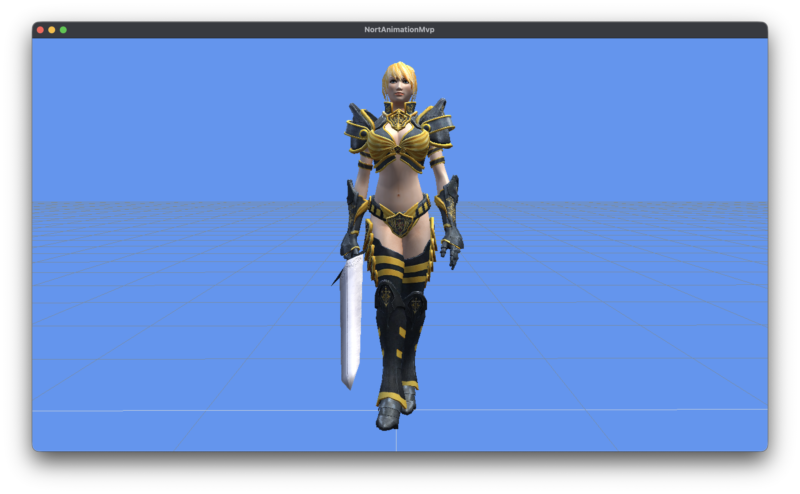

# MonoGame Mixamo MVP

MVP de runtime animation layer com:

- organização de clips por nome (`idle`, `walk`, `run`, `bash`)
- `Animator` com playback + `CrossFade`
- pose em arrays contíguos (`Vector3[]`, `Quaternion[]`, `Vector3[]`)
- conversão local -> model/global -> skin palette
- GPU skinning com `SkinnedEffect`
- bone remap por submesh (`SkinnedMeshPart.BoneRemap`)
- textura difusa por material GLB (embutida/external, fallback branco)
- fundo `CornflowerBlue` e chão quadriculado (linhas 1m)



## Estrutura

- `Assets/GlbRuntimeLoader.cs`: importa GLB de modelo (T-pose) + GLB de animações
  - modelos *raw* foram convertidos do [mixamo](https://www.mixamo.com/) usando o script [m2g](https://github.com/rholdorf/m2g).
- `Runtime/*`: formato runtime-friendly (skeleton, meshpart, clips)
- `Animation/Animator.cs`: sample, blend, geração de skin matrices
- `Rendering/SkinnedMeshRenderer.cs`: upload da palette e draw
- `GameRoot.cs`: cena MVP e troca de animações no teclado

## Controles

- `1`: idle
- `2`: walk
- `3`: run
- `4`: bash
- `W/S`: frente/trás
- `A/D`: girar esquerda/direita (estilo tanque)
- `Q/E`: strafe lateral (esquerda/direita)
- `Mouse`: olhar (yaw/pitch)
- `Scroll`: zoom (FOV)
- `Shift`: mover câmera mais rápido
- `ESC`: sair

## Rodar

### Pré-requisito (macOS)

Nenhum requisito de Assimp/FBX. O runtime lê GLB diretamente.

No diretório raiz:

```bash
dotnet build NortAnimationMvp.sln
dotnet run --project NortAnimationMvp/NortAnimationMvp.csproj
```

Requisito: ambiente com OpenGL/SDL2 funcional (janela gráfica).

## Culling do modelo

No arquivo `/Users/rui/src/pg/nort/NortAnimationMvp/GameRoot.cs`:

- `UseAutomaticModelCulling = true`: usa heurística do loader para escolher `CullClockwiseFace` ou `CullCounterClockwiseFace`.
- `UseAutomaticModelCulling = false`: usa o valor fixo de `ManualModelCullMode`.

Isso facilita manter o mesmo runtime para modelos com winding diferente.
